# Razorpay ReserveEngine ⚡

> **Enterprise Autonomous Agent Mandate & Execution Console**  
> Built on **NPCI UPI Reserve Pay (Single Block Multi-Debit - SBMD v1.4)** Standards.

[](https://www.typescriptlang.org/)
[](https://nodejs.org/)
[](https://www.npci.org.in/)
[](https://razorpay.com/)
[](https://vitest.dev/)
[](LICENSE)

---

## 🏛️ Executive Summary

In 2026, autonomous AI buyer agents (Claude, OpenAI agents, devops bots) need to book cloud compute, lease GPU clusters, and procure developer APIs on behalf of enterprise teams **without exposing raw credit/debit card numbers or triggering manual 2FA/OTP interruptions for every micro-transaction**.

**Razorpay ReserveEngine** solves this by implementing **NPCI UPI Reserve Pay (Single Block Multi-Debit - SBMD)**:
1. **Pre-Authorized Payer Block**: The enterprise treasury signs a pre-authorized budget mandate (e.g. ₹5,000 / 500,000 paise) with designated Merchant Category Codes (MCC).
2. **Autonomous Delegated Debits**: Authorized AI agents query machine-readable service catalogs and autonomously execute bounded debits against the mandate.
3. **Deterministic Financial Gatekeeper**: The gatekeeper strictly evaluates idempotency, validity, permitted MCCs, and unspent reserve headroom using integer paise arithmetic. Under NO circumstances does an LLM calculate prices or adjust balances.
4. **Cryptographic Tamper-Evident Ledger**: Every settled or rejected transaction produces an immutable audit record signed with **HMAC-SHA256** using the Razorpay API secret.

---

## 🔄 Architecture & Transaction Lifecycle

```mermaid
sequenceDiagram
    autonumber
    actor Treasury as Enterprise Treasury (Payer)
    participant Console as ReserveEngine Dashboard
    participant Gateway as SettlementGateway (Gatekeeper)
    participant Agent as Autonomous AI Agent
    participant Razorpay as Razorpay Settlement Engine

    Treasury->>Gateway: Signs UPI SBMD Mandate (₹5,000 Reserve, Allowed MCCs: [7372, 8999, 7311])
    Gateway-->>Console: Generates Initial RESERVE_HOLD & Issues SBMD Token
    
    Agent->>Gateway: Discovers Services Catalog (H100 GPU, Vector DB, DNS Registrar)
    Agent->>Gateway: Inspects Live Available Headroom in Integer Paise
    
    rect rgb(18, 23, 33)
        Note over Agent,Gateway: Delegated Debit Phase (Single Block Multi-Debit)
        Agent->>Gateway: processDelegatedDebit(mandateId, amountPaise, merchantVpa, mcc, idempotencyKey)
        Gateway->>Gateway: 1. Idempotency Check (Prevent duplicate debits)
        Gateway->>Gateway: 2. Mandate Status Check (Active & non-expired)
        Gateway->>Gateway: 3. MCC Policy Check (Must match mandate whitelist)
        Gateway->>Gateway: 4. Headroom Invariant Check (consumed + debit <= totalAuthorized)
        
        alt Valid Debit (Policy & Headroom Verified)
            Gateway->>Razorpay: Creates Order / Payment Capture
            Gateway->>Gateway: Computes HMAC-SHA256 Cryptographic Signature Proof
            Gateway->>Gateway: Atomically Decrements Headroom in Integer Paise
            Gateway-->>Agent: Returns Settled Receipt & Cryptographic Audit Entry
            Gateway-->>Console: Updates Available Headroom & Live Ledger Row
        else Forbidden MCC (e.g., Gambling/Betting MCC 7995)
            Gateway->>Gateway: Logs BLOCKED_POLICY in Tamper-Evident Ledger
            Gateway-->>Agent: Throws PolicyViolationError (0 Funds Deducted)
        else Headroom Breach (Exceeds Reserve Ceiling)
            Gateway->>Gateway: Logs BLOCKED_INSUFFICIENT_HEADROOM in Ledger
            Gateway-->>Agent: Throws InsufficientHeadroomError (0 Funds Deducted)
        end
    end
```



---

## 🛠️ System Components

### 1. Data Models & Ledger Specification (`src/models/types.ts`)
- **`MandateToken`**: Conforms to NPCI SBMD specifications (`id`, `payerVpa`, `authorizedAgentId`, `totalAuthorizedPaise`, `consumedPaise`, `availableHeadroomPaise`, `allowedMcc`, `status: ACTIVE | REVOKED | EXHAUSTED`, `expiresAt`).
- **`LedgerEntry`**: Immutable transaction records signed with SHA-256 HMAC proofs computed over `mandateId + amountPaise + timestamp + idempotencyKey + verdict`.
- **`AgentService`**: Enterprise developer compute catalog with merchant VPA and MCC designations.

### 2. Guardrailed Gatekeeper (`src/services/settlementGateway.ts`)
- **Deterministic Math Invariant**: All arithmetic operates on integer paise (`1 INR = 100 paise`). Floating-point rounding errors and LLM hallucinated math are mathematically impossible.
- **Multi-Stage Security Gatekeeper**:
  1. *Idempotency Check*: Guarantees exactly-once execution.
  2. *Mandate Status Verification*: Rejects revoked or expired mandates.
  3. *MCC Whitelist Enforcement*: Blocks unauthorized merchant categories.
  4. *Headroom Invariant Enforcement*: Rejects debits exceeding unspent reserve headroom.
  5. *Razorpay API Settlement*: Integrates with Razorpay SDK with deterministic receipts in sandbox mode.
  6. *HMAC-SHA256 Signature Proof*: Verifiable cryptographic tamper-evidence.

### 3. Agent Tool Layer (`src/agent/agentTools.ts`)
- Gemini function declarations:
  - `discoverAgentServices()`: Discovers compute and API services.
  - `inspectMandateHeadroom(mandateId)`: Real-time non-mutating headroom inspection.
  - `dispatchSettlement(mandateId, serviceKey, purpose)`: Dispatches bounded debits through the gatekeeper.
- Autonomous mission runner streaming live execution traces (`DISCOVERY` -> `HEADROOM_CHECK` -> `GATEWAY_VALIDATION` -> `SETTLEMENT` / `BLOCKED`).

### 4. High-Density Enterprise Console (`public/`)
- Built with a dark enterprise design language inspired by Stripe Dashboard & RazorpayX (`#0B0E14` charcoal, `#1E2538` slate borders, JetBrains Mono data grids).
- **Top KPI Metrics**: Total Reserve Authorized, Available Headroom (with dynamic progress meter), and Security Incidents Blocked counter.
- **Autonomous Mission Dispatcher**: Input operational missions with 3 quick-run scenarios:
  - ⚡ **Safe Mission**: H100 GPU Compute + Vector DB (Within Headroom)
  - 🛑 **Overspend Mission**: ₹8,000 Server Cluster (Exceeds Headroom)
  - 🚫 **Forbidden MCC Mission**: Casino/Gambling Compute (Blocked by MCC `7995`)
- **Forensic Audit Ledger Table**: Live tabular audit records with color-coded status badges and clickable rows opening the **HMAC Cryptographic Proof Inspector Modal**.

---

## 📡 REST API Reference

| Method | Endpoint | Description |
|---|---|---|
| `GET` | `/api/mandates/active` | Retrieves live active mandate state, spent percentage, and headroom |
| `GET` | `/api/ledger` | Returns full chronological audit trail with HMAC-SHA256 signatures |
| `GET` | `/api/services` | Returns catalog of eligible cloud & developer services |
| `POST` | `/api/agent/dispatch` | Dispatches autonomous agent mission with step-by-step reasoning trace |
| `POST` | `/api/mandates/revoke` | Manually revokes active token, immediately halting further debits |
| `POST` | `/api/mandates/reset` | Resets demo mandate to ₹5,000 initial reserve hold |

---

## 🚀 Getting Started

### Prerequisites
- Node.js >= 18.0.0
- npm >= 9.0.0

### Installation
```bash
# Clone the repository
git clone https://github.com/Mansi5543/razorpay-reserve-engine.git
cd razorpay-reserve-engine

# Install dependencies
npm install
```

### Environment Configuration
Copy the `.env.example` file:
```bash
cp .env.example .env
```

Ensure `.env` contains your configuration:
```env
PORT=3000
RAZORPAY_KEY_ID=rzp_test_placeholder
RAZORPAY_KEY_SECRET=placeholder_secret
GEMINI_API_KEY=placeholder_gemini_key
```

### Running the Application

```bash
# Development server (with hot reload via tsx)
npm run dev

# Build for production
npm run build

# Start production server
npm start
```

Access the enterprise console at: **[http://localhost:3000](http://localhost:3000)**

---

## 🧪 Automated Guardrail Test Suite

The engine includes **30 automated tests** using Vitest:

```bash
npm test
```

### Test Coverage Highlights:
- **Headroom Arithmetic**: Validates integer paise balance deductions.
- **Overspend Protection**: Throws `InsufficientHeadroomError` and records `BLOCKED_INSUFFICIENT_HEADROOM` when an agent attempts to exceed reserve.
- **MCC Policy Gatekeeper**: Throws `PolicyViolationError` and logs `BLOCKED_POLICY` on unauthorized merchant categories.
- **Idempotency**: Prevents double-debiting on duplicate request keys.
- **Cryptographic Tamper-Evidence**: Recomputes and verifies HMAC-SHA256 signatures over canonical payload parameters.

---

## 📄 License

Distributed under the Apache-2.0 License. See `LICENSE` for more information.
